# 스마트 기기를 이용한 교내 비정기 행사 관리 시스템 스탑웨이팅

> 개발 기간 : 2022.01.04 ~ 2022.06.14   
> 개발 인원 : 4명

## 📑 목차

1.  [프로젝트 기획 배경](#프로젝트-기획-배경)
2.  [주요 기능 설명](#주요-기능-설명)
3. [기술 스택](#기술-스택)
4. [아키텍처](#아키텍처)
5. [ERD](#erd)
6. [인터페이스](#인터페이스)
7. [팀원 소개 및 역할](#팀원-소개-및-역할)

## 📌프로젝트 기획 배경

- 유명하거나 인기 있는 장소에 입장하기 위해 입장 대기를 하는 곳이 많다.
  특히 사람이 많은 시간대에는 어느 가게를 가도 필연적으로 기다림이 발생하게 된다.
  때문에 불필요한 시간 낭비 및 대면접촉을 하게 되고, 이는 교내에서도 마찬가지이다.
  현재 대부분의 웨이팅 애플리케이션은 사업자가 사용료를 납부해야 서비스를 이용할 수 있기 때문에 교내 식당 및 미용실 등 편의 시설이나 교내 특식 배부 장소에서는 사용이 불가능하다.

=> 코로나로 인해 비대면 활동이 많아진 지금, 교내 QR코드를 이용하여 교내 식당/미용실 같은 편의 시설과 특식 배부같은 이벤트에서 사용 가능한 교내 웨이팅 어플리케이션을 개발하였다.

## 🔎주요 기능 설명

- 지도에 원하는 카테고리별 아이콘 표시
- 지도상의 위치 및 현재 인원, 대기 인원 현황 확인
- 비대면 대기 번호 발급 및 처리
- 웨어러블 장치(스마트 워치)를 통한 대기열 확인/취소 및 알람
- 현재 위치 주위에 근처의 웨이팅 조회
- 교내 QR코드를 이용하여 웨이팅 체크인
- Firebase Cloud Messaging을 이용한 어플 푸시알림

## 🛠기술 스택

<table>
<tr>
 <td align="center">언어</td>
 <td>
  

 </td>
</tr>
<tr>
 <td align="center">프레임워크</td>
 <td>
  
</tr>
<tr>
 <td align="center">라이브러리</td>
 <td>

</tr>
<tr>
 <td align="center">패키지 매니저</td>
 <td>
    

  </td>
</tr>
<tr>
 <td align="center">인프라</td>
 <td>
  
  
  
  
  
  

</tr>

<tr>
 <td align="center">협업툴</td>
 <td>
    
     
     
 </td>
</tr>
<tr>
 <td align="center">기타</td>
 <td>
    
     
    
 </td>
</tr>
</table>

## 🧱아키텍처
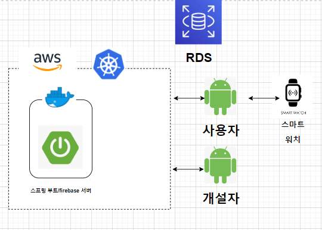

## ERD
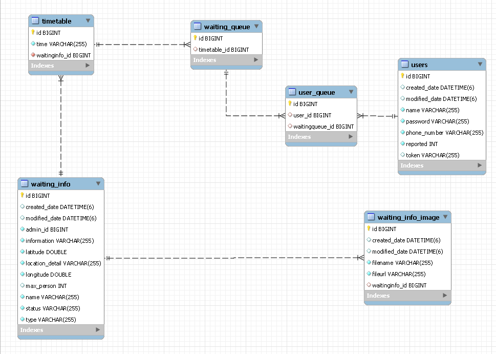

## 인터페이스
 - 웨이팅 진행 현황 조회(지도)

    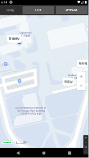

 - 웨이팅 시간 선택

    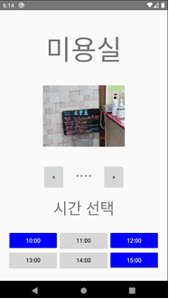
 - 웨이팅 등록

    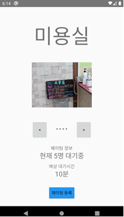

 - 장소 설정

    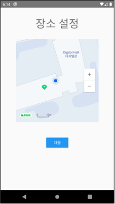

 - 장소 세부 설정(웨이팅 종류 설정)

    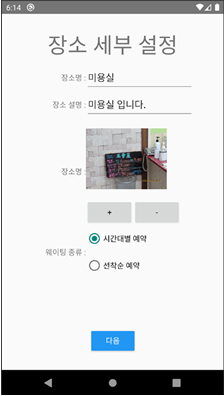

 - 장소 세부 설정(장소 시간 설정)

    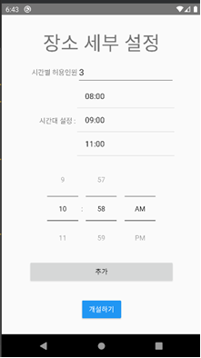

 - 승인 대기중인 웨이팅

    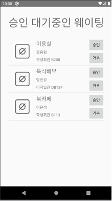

 - 대기중인 웨이팅 목록 - 웨어러블 디바이스

    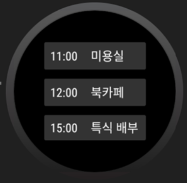

 - 웨이팅 세부 확인 - 웨어러블 디바이스

    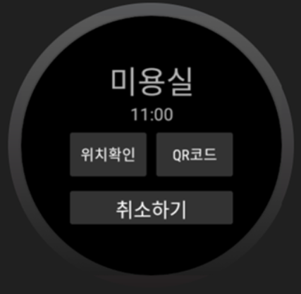

 - 지도 내 위치 확인 - 웨어러블 디바이스

    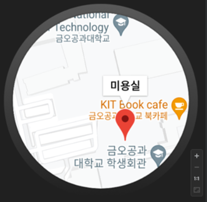
## 팀 소개
* 방진성 : 스탑웨이팅 서버 개발, Wear 어플리케이션 개발
* 이윤석 : 스탑웨이팅 메인 어플리케이션 개발
* 한기윤 : 스탑웨이팅 서버 개발
* 한유현 : 스탑웨이팅 관리자 어플리케이션 개발

